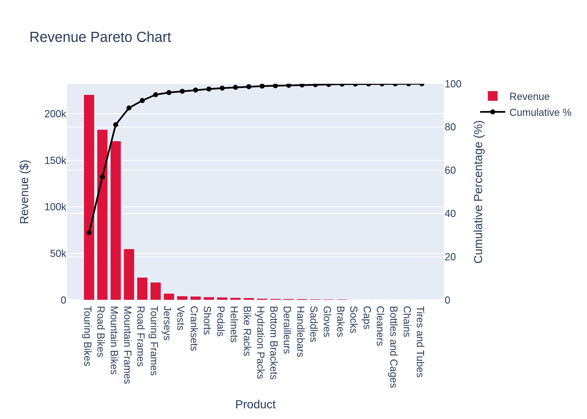
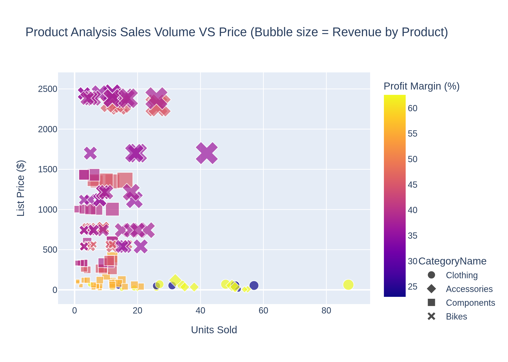
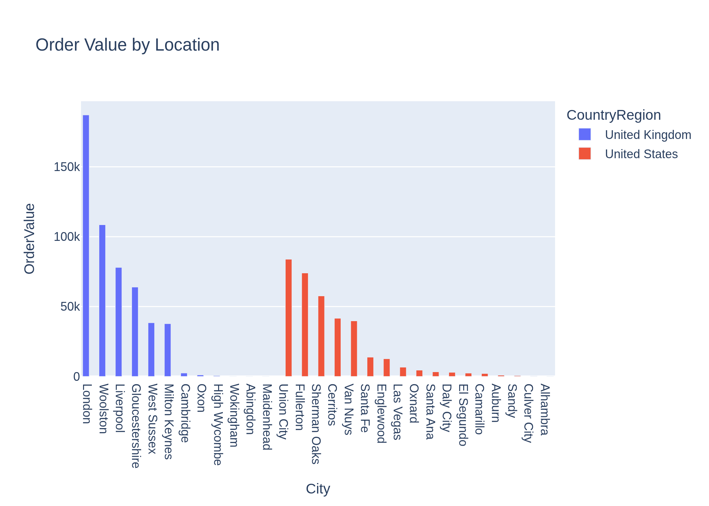

# AdventureWorks Sales Analysis
This is a data analysis project analyzing the dataset AdventureWorks using tools such as SQL, Python Pandas & Plotly for visualization. This w=analysis aims to answer key business questions such as High performing products, factors affecting revenue and sales volume and geographical distribution of sales order.

## Project Overview
End-to-end sales performance analysis aiming to answer key business questions such as :
How is revenue distributed across products and categories?
How do profit margins vary across different products?
How sales volume is affected by pricing and other factors?
How is revenue distributed among products?
How can these insights help management? 

## Dataset
AdventureWorks sample database
32 sales orders
142 products with recorded sales

## Tools
SQL  
SQLite
Python
Pandas
Plotly

## Repository Structure
images/
data/
notebook
requirements.txt

## Visualizations

### Revenue Distribution
This visualization shows how revenue is distributed across different product sub-categories and what limited products make up 80% of all revenue generated.

### Product Performance Bubble Chart
This visualization provides a multi dimensional view for each product in effort to explain factors influence high performance such as profit margin, sales volume.

### Order Analysis
This visualization provides a distribution trend across different cities in effort to highlight strong market areas.

## Key Findings
Bike products are primary contributors to company revenue.
Revenue is concentrated among a relatively small number of premium products.
Profit margin alone does not explain product demand.
High sales volume do not necessarily translate into high revenue.
The dataset is limited in customer and temporal scope; therefore, findings should be interpreted within those contraints.

## Limitations
The dataset contains data for only 2 countries hence geographical analysis was limited to those markets.
All sales order within 06-2008; therefore insights about seasonality is limited.
Transactions for only 32 sales order available therefore interprt data as exploratory.

## Future Work
Expand the analysis with larger dataset.
Analyzing discount impacts on sales performance.
Analyze the relationship of  freight amount and tax amount on sales performance 
Create a interactive PowerBI Dashboard to monitor sales and product performance

